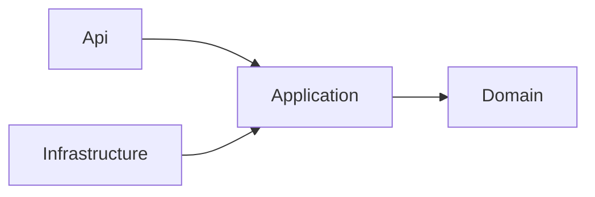
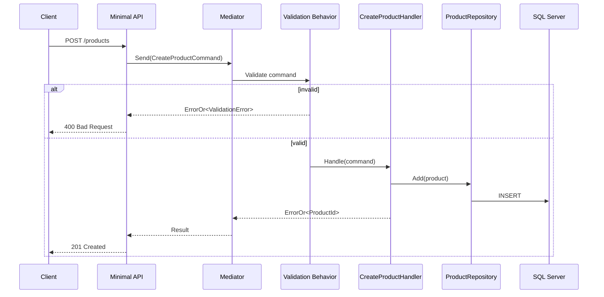

# Product Catalog — Architecture

## Layers and Dependency Rule

Dependencies point inward, toward the Domain layer. Infrastructure and Api
depend on Application; Application depends on Domain; Domain depends on
nothing.

- **Domain** — `Product` aggregate, invariants, domain events. No external
  dependencies.
- **Application** — commands, queries, handlers, validators, and the
  repository interfaces Infrastructure implements.
- **Infrastructure** — EF Core `DbContext`, repository implementations, SQL
  Server access.
- **Api** — Minimal API endpoints, request/response mapping.

`AppHost` and `ServiceDefaults` sit outside this dependency chain - they are
not architectural layers, they are the composition root and cross-cutting
host concerns:

- **AppHost** — the .NET Aspire entry point. Wires the `Api` project to the
  LocalDB connection string and runs the Aspire dashboard. Nothing else
  depends on it; it depends on `Api`.
- **ServiceDefaults** — shared host configuration (OpenTelemetry, health
  checks, resilience defaults) referenced by `Api`.

## Key Decisions

| Decision               | Choice                                                                              | Reasoning                                                                                                                                                 |
| ---------------------- | ----------------------------------------------------------------------------------- | --------------------------------------------------------------------------------------------------------------------------------------------------------- |
| Read/write access      | Repository pattern for writes; direct EF Core queries (`.AsNoTracking()`) for reads | A generic repository used for reads tends to leak `IQueryable` and become an anti-pattern                                                                 |
| Command/query dispatch | `Mediator` (source-generator library)                                               | Fully free, no commercial licensing (unlike MediatR's dual-license model); used specifically to demonstrate pipeline behaviors, not for indirection alone |
| Validation             | FluentValidation as a Mediator pipeline behavior                                    | Keeps validation out of handlers                                                                                                                          |
| API layer              | ASP.NET Core Minimal API                                                            | Native mechanism, no extra framework dependency. FastEndpoints is used elsewhere in the portfolio to keep stack variety                                   |
| Error handling         | `ErrorOr`                                                                           | Avoids exceptions for expected business errors (e.g. duplicate SKU)                                                                                       |
| API documentation      | Scalar                                                                              | Current standard replacement for Swagger UI in ASP.NET Core                                                                                               |

## Request Flow: Create Product

