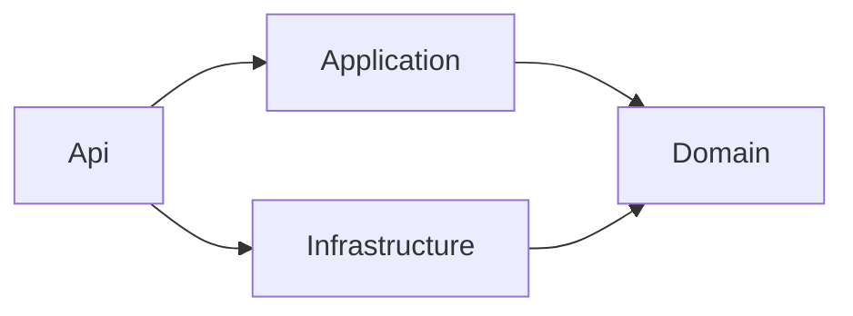
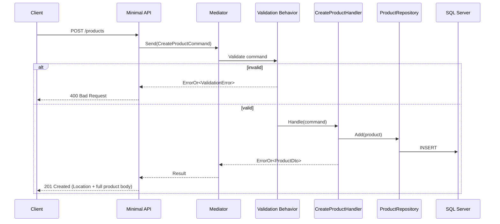

# Product Catalog — Architecture

## Layers and Dependency Rule

Dependencies point inward, toward the Domain layer.

- **Domain** — `Product` aggregate, invariants, domain events, and the
  `IProductRepository`/`IUnitOfWork` interfaces Infrastructure implements.
  No external dependencies except `Mediator.INotification` (see ADR-0003).
- **Application** — commands, queries, handlers, validators. Organized by
  kind (`Commands/`, `Queries/`, `EventHandlers/`, `Behaviors/`,
  `Models/`), then by aggregate.
- **Infrastructure** — EF Core `DbContext`, repository implementations,
  SQL Server access.
- **Api** — Minimal API endpoints (`Endpoints/`), exception handling
  (`ExceptionHandling/`), `ErrorOr` → HTTP problem mapping.

Why these choices over the alternatives considered: see
[`docs/adr/`](adr/).

## Domain Event Dispatch

Aggregates raise events into an in-memory list (`Product.DomainEvents`);
nothing is published until persistence actually succeeds. A `SaveChanges`
interceptor (`DispatchDomainEventsInterceptor`, Infrastructure) collects
pending events from tracked entities after `SavedChangesAsync`, clears them,
and publishes each one through Mediator - handlers (e.g.
`ProductCreatedEventHandler`) then react to it. Dispatching after the save
(not before) avoids publishing an event for a change that didn't actually
commit.

## Request Flow: Create Product

