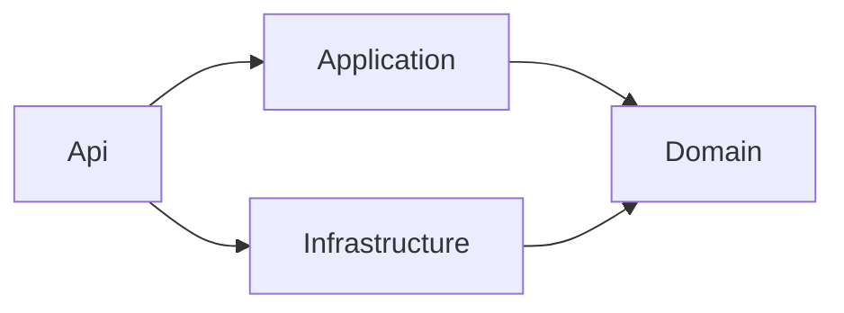
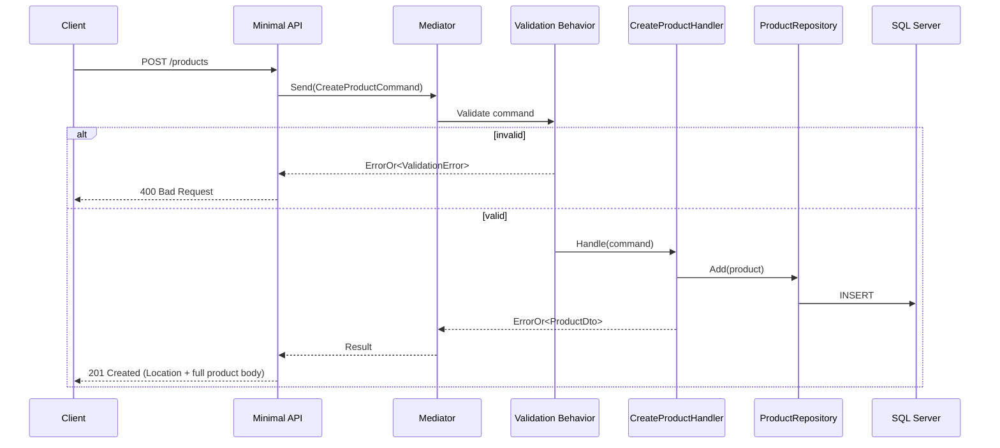

# Product Catalog — Architecture

## Layers and Dependency Rule

Dependencies point inward, toward the Domain layer. Application and
Infrastructure depend on Domain; Api depends on Application and
Infrastructure; Domain depends on nothing.

- **Domain** — `Product` aggregate, invariants, domain events, and the
  repository (`IProductRepository`) and unit-of-work (`IUnitOfWork`)
  interfaces Infrastructure implements. Repository interfaces live here
  rather than in Application - they express a domain concept (a
  collection-like abstraction over an aggregate), only the implementation
  is a persistence concern. One deliberate exception to "no external
  dependencies": `IDomainEvent` inherits `Mediator.INotification` directly,
  so domain events are publishable without a wrapper type - `Mediator`'s
  source generator needs a closed, concrete message type per handler, so a
  generic bridge type outside Domain doesn't work the way it would with a
  reflection-based mediator like MediatR.
- **Application** — commands, queries, handlers, validators. Organized by
  kind first (`Commands/`, `Queries/`, `EventHandlers/`, `Behaviors/`,
  `Models/`), then by aggregate one level in (e.g.
  `Commands/Products/Create/`) - kept consistent with Domain and
  eShopOnContainers rather than the feature-folder-first style common in
  Vertical Slice Architecture writeups (e.g. Milan Jovanović's), since this
  project deliberately chose classic layered Clean Architecture over
  Vertical Slice (see `charter.md`). An event handler also isn't a use case
  in the same sense a command/query is (it reacts to something that
  already happened, isn't driven by an incoming request/response), so it
  doesn't belong inside a use-case tree either way. `Models/` holds read
  DTOs shared across a use case's handlers for the same aggregate - every
  command/query that returns a product (`CreateProduct`, `GetProductById`,
  `UpdateProduct`, `ChangePrice`, `DeactivateProduct`, `ReactivateProduct`,
  `AdjustStock`) reuses the single `ProductDto`, and `GetProducts` wraps it in a generic
  `PagedResult<T>` rather than a separate `ProductSummaryDto` - one shape
  per aggregate concern, not one per command, to avoid a parallel
  near-identical DTO per use case. The Api layer reuses these directly as
  its response bodies instead of mapping them into its own duplicate types
  - consistent with the Api layer already reusing Domain's `ProductCategory`
  enum directly in its request/response records.
- **Infrastructure** — EF Core `DbContext`, repository implementations, SQL
  Server access.
- **Api** — Minimal API endpoints, request/response mapping. Organized by
  kind first too, mirroring Application: `Endpoints/` (feature-scoped route
  handlers, e.g. `Endpoints/Products/`), `ExceptionHandling/`
  (`IExceptionHandler` implementations - its own top-level folder rather
  than a nested one, since it's first-class ASP.NET Core pipeline
  configuration, not a minor utility). `ErrorOr` → HTTP problem mapping
  lives in a single `ErrorOrMinimalApiExtensions.cs` at the project root -
  not enough surface area yet to earn its own folder. No generic
  `Common`/`Shared` folder in either Application or Api - each cross-cutting
  concern gets a name specific enough to say what it actually is.

## Key Decisions

| Decision               | Choice                                                                              | Reasoning                                                                                                                                                 |
| ---------------------- | ----------------------------------------------------------------------------------- | --------------------------------------------------------------------------------------------------------------------------------------------------------- |
| Read/write access      | Repository pattern for writes; direct EF Core queries (`.AsNoTracking()`) for reads | A generic repository used for reads tends to leak `IQueryable` and become an anti-pattern                                                                 |
| Command/query dispatch | `Mediator` (source-generator library)                                               | Fully free, no commercial licensing (unlike MediatR's dual-license model); used specifically to demonstrate pipeline behaviors, not for indirection alone |
| Validation             | FluentValidation as a Mediator pipeline behavior                                    | Keeps validation out of handlers                                                                                                                          |
| API layer              | ASP.NET Core Minimal API                                                            | Native mechanism, no extra framework dependency. FastEndpoints is used elsewhere in the portfolio to keep stack variety                                   |
| Error handling         | `ErrorOr` for Application-level errors (validation, conflict); `DomainException` + a global `IExceptionHandler` for domain invariant violations | `ErrorOr` avoids exceptions for errors a handler can anticipate (e.g. duplicate SKU). Domain invariants (e.g. price <= 0) still throw - by the time a handler calls the aggregate, upstream validation should already have caught it, so hitting the throw path is a guard, not a normal branch |
| API documentation      | Scalar                                                                              | Current standard replacement for Swagger UI in ASP.NET Core                                                                                               |
| 201 response body      | The full created resource (`ProductDto`), not just its id                          | RFC 9110 §10.2.2: a 201 response "typically describes and links to the resource(s) created" - the `Location` header alone isn't enough for a client to render something without a follow-up GET |
| Lifecycle actions      | `POST /products/{id}/deactivate` and `.../reactivate`, not the `DELETE` verb        | `DELETE` implies permanent removal, which this domain doesn't have. `PATCH` implies a body of changes to apply (RFC 5789); these take none. Mirrors Gmail's trash/untrash (`POST`, no body) |
| Partial field update   | `PATCH /products/{id}/stock` (`AdjustStock`) and `PATCH /products/{id}/price` (`ChangePrice`) carry a body (`quantityDelta`, `newPrice`) | A client-supplied value being applied is exactly what `PATCH` is for |
| Local dev orchestration | Aspire `AppHost`/`ServiceDefaults`, scoped to local dev and shared OTel/logging/health-check wiring only | Runs a real SQL Server container so dev/tests/prod share the same engine. Not used for cloud provisioning - IaC is hand-written Terraform; `azd`'s Bicep auto-generation was considered and rejected for the same reason |
| Logging → OTLP          | Serilog stays the logging pipeline; `Serilog.Sinks.OpenTelemetry` forwards to the same OTLP endpoint as traces/metrics | Keeps Serilog's existing config/enrichers unchanged while landing logs next to traces/metrics in one place - no second logging pipeline to maintain |

## Domain Event Dispatch

Aggregates raise events into an in-memory list (`Product.DomainEvents`);
nothing is published until persistence actually succeeds. A `SaveChanges`
interceptor (`DispatchDomainEventsInterceptor`, Infrastructure) collects
pending events from tracked entities after `SavedChangesAsync`, clears them,
and publishes each one through Mediator - handlers (e.g.
`ProductCreatedEventHandler`) then react to it. Dispatching after the save
(not before) avoids publishing an event for a change that didn't actually
commit.

## Request Flow: Create Product

