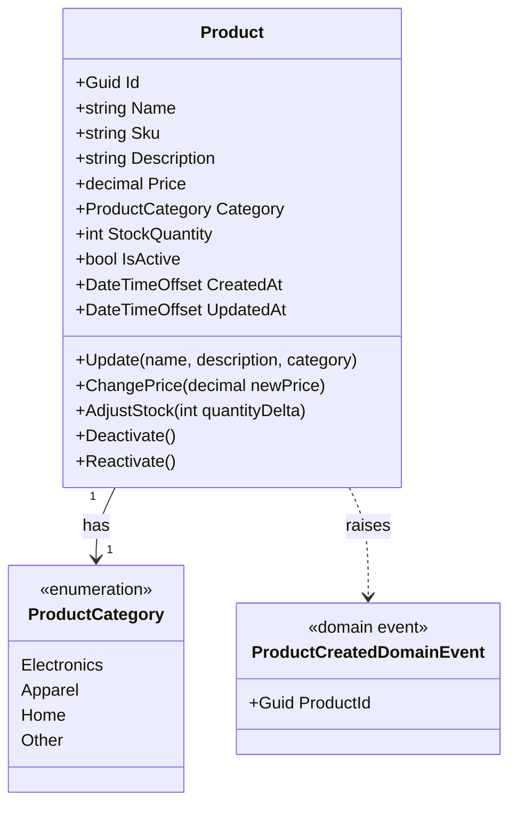
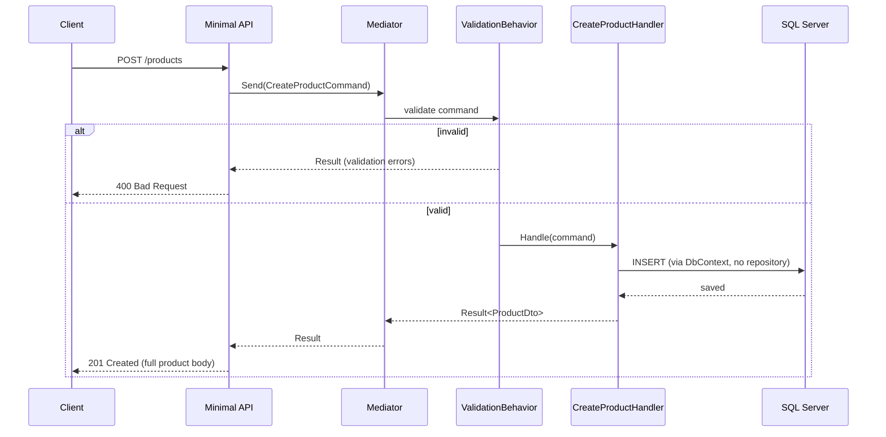

# Architecture

## Domain Model

`Product` is the only aggregate root. Invariants: SKU is unique (enforced by a DB unique index), `Price > 0`, `StockQuantity >= 0`. Deactivation is a soft delete (`IsActive = false`), reversible via reactivation — products are never physically removed.

## Request Flow

`CreateProduct`, as a representative example — every command/query follows the same shape (Minimal API endpoint → `Mediator` → `ValidationBehavior` → handler):

Domain events (e.g. `ProductCreatedDomainEvent`) are dispatched through the same `Mediator`, by a `SaveChanges` interceptor (`DispatchDomainEventsInterceptor`) — and only after the write actually commits, never before, so an event never fires for a change that didn't persist.
