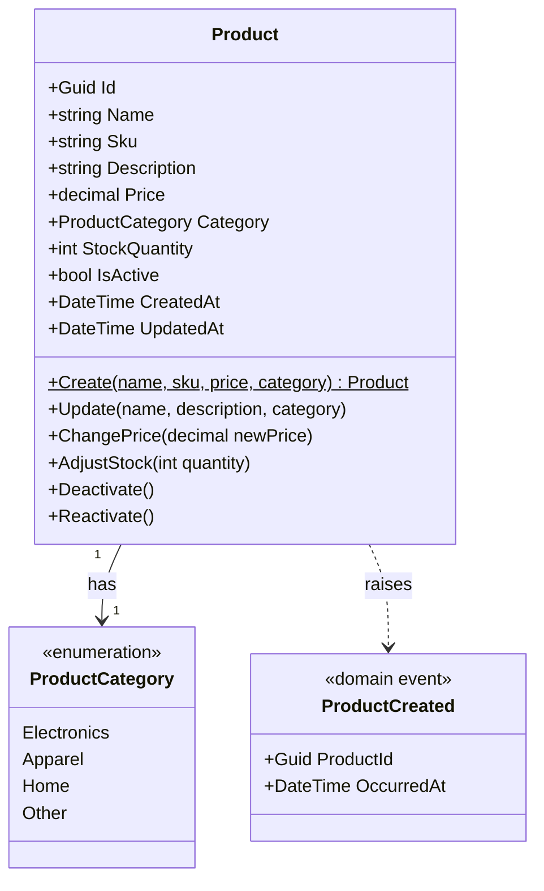

# Product Catalog — Domain Model

## Aggregate: Product

`Product` is the only aggregate root in this domain. There are no
sub-entities or nested aggregates.

### Invariants

- SKU must be unique across all products
- Price must be greater than zero
- Stock quantity cannot be negative
- Deactivation is a soft delete (`IsActive = false`); products are never
  physically removed

### Domain Events

- `ProductCreated` — raised when a product is created, dispatched after
  persistence. Included as a deliberate demonstration of the domain events
  pattern; this domain has no other event worth modeling.

### Use Cases

- CreateProduct
- UpdateProduct (name, description, category)
- ChangePrice
- AdjustStock
- DeactivateProduct
- ReactivateProduct
- GetProduct
- ListProducts (paginated, filterable by `isActive`)

