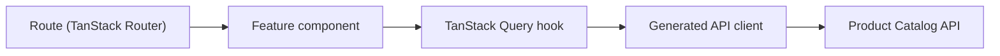

# Product Catalog Frontend — Architecture

## Data Flow

- **`routes/`** — TanStack Router file-based routes; one file per URL.
- **`features/products/`** — components, TanStack Query hooks, and form
  logic for the Product feature.
- **`lib/api/`** — client generated from the API's OpenAPI document,
  regenerated whenever the API's contract changes.
- **`components/ui/`** — shadcn/ui primitives, shared across features.

Why these choices over the alternatives considered: see
[`docs/adr/`](adr/).

## Backend Contract

The frontend has no database and no business rules of its own - every
mutation and read goes through the Product Catalog API. `domain-model.md`
and the API's own OpenAPI document (`/openapi/v1.json`) are the source of
truth for what's available.
